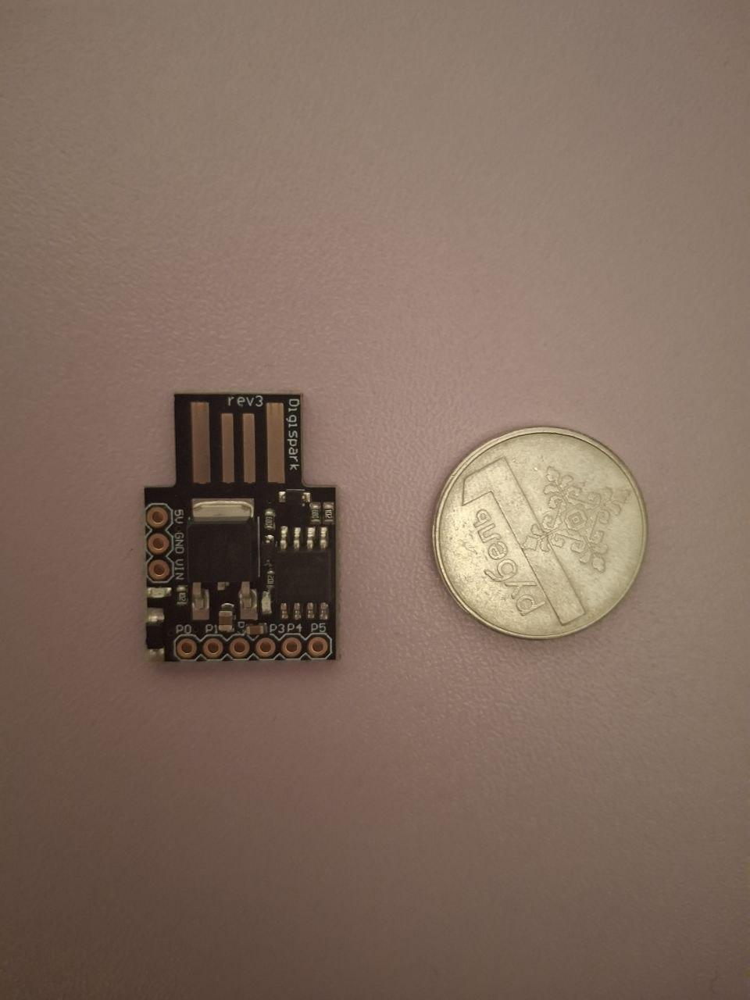

# DigisparkATtiny85

Этот код превращает мелкую плату Digispark в полноценный BadUSB.

Суть: вставляете эту копеечную флешку-чип в USB-порт любого ПК/ноута => система детектит ее как обычную клавиатуру. Затем флешка-чип на бешеной скорости вколачивает прописанные команды. В данном случае он через PowerShell в фоне делает скриншот рабочего стола и шпионит за файлами в профиле юзера, упаковывая все это в архив и сливая на внешний веб-сервер через интернет. (можно прописать что-то и покруче и конечно с обфускацией антивируса ;)))))

